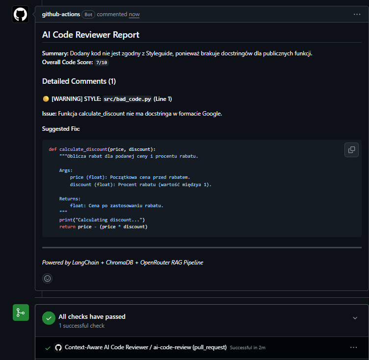
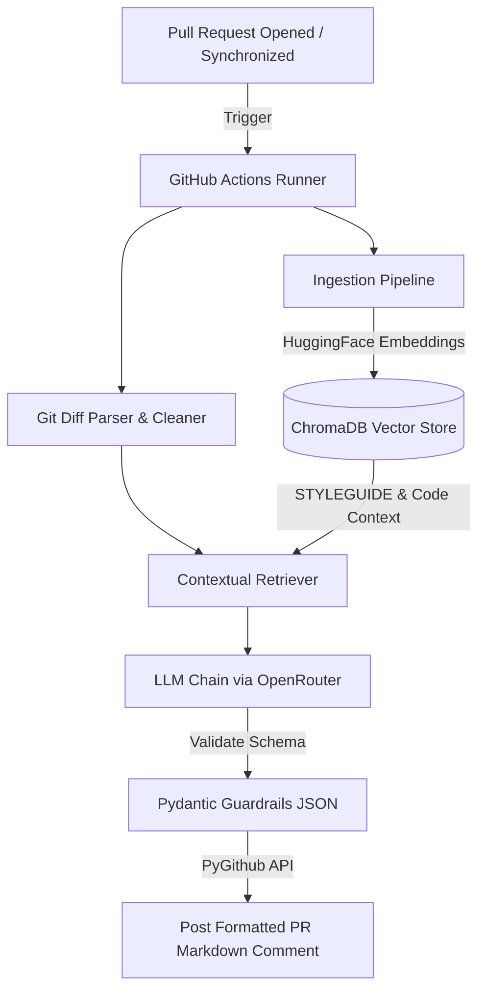

# Context-Aware AI Code Reviewer & PR Assistant (RAG + GitOps)

[](https://www.python.org/downloads/)
[](https://github.com/astral-sh/uv)
[](https://www.langchain.com/)
[](https://www.trychroma.com/)
[](https://github.com/features/actions)

An automated, context-aware AI Code Reviewer that integrates into GitHub CI/CD workflows. It analyzes Pull Request diffs, queries a local **ChromaDB** vector store for repository-specific style guidelines (`STYLEGUIDE.md`) and related code context, enforces deterministic JSON schemas using **Pydantic Guardrails**, and posts structured review comments directly to the PR.

---

## Live Demo

Here is the AI Code Reviewer automatically catching missing docstrings and style violations on a real Pull Request:



> **[👉 View Live Pull Request Demo](https://github.com/SebaKo23/ai-code-reviewer/pull/1)**

---

## System Architecture

The pipeline follows a GitOps-driven Retrieval-Augmented Generation (RAG) architecture:



---

## Key Features

* **Syntax-Aware Code Splitting:** Uses LangChain's `RecursiveCharacterTextSplitter.from_language(Language.PYTHON)` to preserve AST integrity (classes/functions) rather than arbitrary character slicing.
* **Contextual Domain RAG:** Ingests internal company rules (`STYLEGUIDE.md`) and existing codebase into a local **ChromaDB** with metadata filtering (`source_type`).
* **Deterministic Guardrails:** Replaces loose markdown output with strict **Pydantic Schema Validation** (`ReviewReport`, `ReviewComment`), extracting exact line numbers, severity levels, and actionable code fixes.
* **Provider-Agnostic LLM Routing:** Built on top of the OpenAI API standard via **OpenRouter**, allowing instant model swapping (Qwen 2.5 Coder, Llama 3.3, GPT-4o-mini) with zero vendor lock-in.
* **Full GitOps & CI/CD Lifecycle:** Packaged into Docker and triggered natively via **GitHub Actions** on every Pull Request event.

---

## Tech Stack

| Component | Technology | Purpose |
| :--- | :--- | :--- |
| **Language & Environment** | Python 3.12, uv | Modern, fast package management and runtime |
| **Vector Database** | ChromaDB (HNSW indexing) | Local persistent vector storage with metadata search |
| **Embedding Model** |sentence-transformers/all-MiniLM-L6-v2 | Free, fast, local CPU-based 384-dim embeddings |
| **AI Orchestration** | LangChain (LCEL) | Modular pipeline composition and retriever interface |
| **LLM Provider** | OpenRouter (qwen-2.5-coder-32b-instruct) | High-performance code analysis |
| **Guardrails & Typing** | Pydantic v2 | Strict JSON output validation |
| **GitOps / CI/CD** | Docker, GitHub Actions, PyGithub | Automated PR interception and commenting |

---

## Project Structure

```text
ai-code-reviewer/
├── .github/
│   └── workflows/
│       └── review.yml      # GitHub Actions CI/CD workflow
├── assets/
│   └── demo.png            # Screenshot for documentation
├── src/
│   ├── __init__.py
│   ├── config.py           # Centralized configuration & environment loader
│   ├── ingestion.py        # Code & Styleguide indexing pipeline (ChromaDB)
│   ├── retriever.py        # Git diff parser & similarity retriever
│   ├── reviewer.py         # LangChain LCEL chain with Pydantic Guardrails
│   └── github_app.py       # PyGithub PR comment publisher
├── Dockerfile              # Containerized runtime configuration
├── pyproject.toml          # uv dependency manifest
├── STYLEGUIDE.md           # Domain knowledge base for RAG context
└── README.md
```

---

## Local Quickstart

### 1. Prerequisites
Install `uv` (fast Python package manager):
```bash
# macOS/Linux
curl -LsSf https://astral.sh/uv/install.sh | sh

# Windows
powershell -c "irm https://astral.sh/uv/install.ps1 | iex"
```

### 2. Installation
```bash
git clone https://github.com/SebaKo23/ai-code-reviewer.git
cd ai-code-reviewer

# Create virtual environment and install all dependencies
uv sync
```

### 3. Environment Configuration
Create a `.env` file in the root directory:
```env
OPENROUTER_API_KEY=your_openrouter_api_key_here
```

### 4. Build Vector Database (Ingestion)
```bash
uv run python -m src.ingestion
```

### 5. Run Local Review Simulation
```bash
uv run python -m src.reviewer
```

---

## GitHub Actions Setup

To enable automated PR reviews in your own repository:
1. Navigate to **Settings > Secrets and variables > Actions** in your GitHub repository.
2. Add a new repository secret:
   * **Name:** `OPENROUTER_API_KEY`
   * **Value:** `your_openrouter_api_key`
3. Open a Pull Request with any `.py` file to see the bot in action!

---

## License
This project is open-source under the [MIT License](LICENSE).